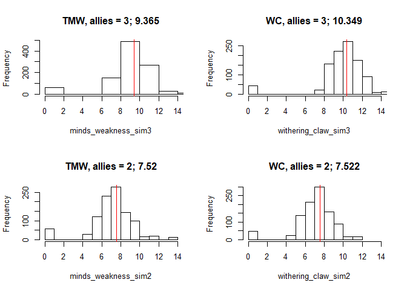

Mindthief Augment Simulation, First Round Damage: TMW vs WC
================

Question
--------

-   Gloomhaven Mindthief (MT) class guides almost unanimously recommend using the augment card "The Mind's Weakness" (TMW) over all other augments for the majority of combat situations
-   The primary reason: TMW's +2 damage for every melee attack means "monsters are dying faster, causing less damage to the MT and other party members"
-   The alternative damage oriented augment is "Withering Claw" (WC), which adds a poison and muddle effect to each enemy the Mindthief hits with melee
    -   Poison = creature receives 1 additional damage for each attack, **does not go away after a creature's turn**
    -   Muddle = creature must attack with Disadvantage, this *does* go away after a creature's turn
    -   Poison can be valuable for taking down shielded enemies
    -   Muddle can be useful on hard hitting/high damage monsters
-   I wanted to explore to what extent this communal wisdom broke down, if at all, through simple simulations because:
    1.  The game seems to be well balanced, how could the design come up so short when it comes to the utility of other augment cards?
    2.  There must be certain sitations where augments other than TMW are "more optimal" to deploy
-   For this very simple simulation, **"more optimal" means 'the augment card that leads to more damage in a single round of combat'**.
-   **We do not consider possible damage mitigation from Withering Claw's "muddle" effect**, which is an important "defensive" feature of Withering Claw

### Graph Interpretation

-   The following graphs are a histogram of the simulation results
-   Each simulation is a round of combat with 0 - 3 allies present (that aid in damage dealt to a single creature)
-   The x-axis is thus total damage dealt by the Mindthief + Party
-   The red line is a visual reference point for the mean damage output for a type of simulation
    -   The numeric value of the red line is also shown in the plot's title

Takeaways
---------

-   The Mind's Weakness outperforms Withering Claw by adding at least 1 additional point of damage up until at least 2 allies are hitting the same creature
-   With 2-3 players hitting the same creature, Withering claw's damage equals TMW at 2 players, and exceeds TMW's damage at 3 players
-   The utility of WC with 2-3 players focusing on a creature becomes more attractive when you consider damage mitigation from Muddle
    -   WC can be particularly useful in "crowd control" situations (e.g. many enemies doing damage at once) if the Mindthief can place two attacks down in a single round on separate creatures (there are a couple MT bottom attack cards)
-   Unfortunately, WC's total utility may be offset when taking on higher level bosses that are immune to most negative effects.
-   Augment choice can thus be very party and scenario dependent

Setup
-----

### Simulation Assumptions

-   The Mindthief attacks first for every iteration of the simulation
-   This is only the first round of combat
-   I do not simulate:
    -   time to kill (ttk), the number of actions or number of rounds it takes to kill a hypothetical monster
    -   a "full round" of combat, the amount of damage the party does PLUS the damage monsters deal (i.e. this would be a more realistic way of simulating how Withering Claw's muddle effect might reduce incoming damage)

### Input Variables

-   The following variables were considered in this simulation:
    -   Mindthief level 1 card attack values = \[2,3,1,3,1,2,1,1\]
    -   Base Attack Modifier Deck = \[0, 0, 0, 0, 0,0, 1,1,1,1,1,-1,-1,-1,-1,-1, 2, -2, "2x", "miss"\]
    -   Two Augment Cards = The Mind's Weakness (TMW) and Withering Claw (WC)
    -   Allies = accounts for damage dealt by other party members, ranges from 0 (no party members adding damage) to 3 (all party members attacking the same monster)
        -   For now, we very simply assume an ally adds +2 damage to the monster with no deck modifiers

### Damage Model

-   The damage model is thus:
    -   total first round damage = `R(MT attack card) + R(attack modifier) + (augment_card) + (ally_damage)`
    -   My notation `R(variable)` indicates that the variable is a single random value drawn from the "pool" of character or attack modifier cards
    -   If `augment_card` = "Withering Claw", `(ally_damage)` = 2 + 1 (+1, from poison) *for each ally's attack*
    -   If `augment_card` = "The Mind's Weakness", `(ally_damage)` = 2
